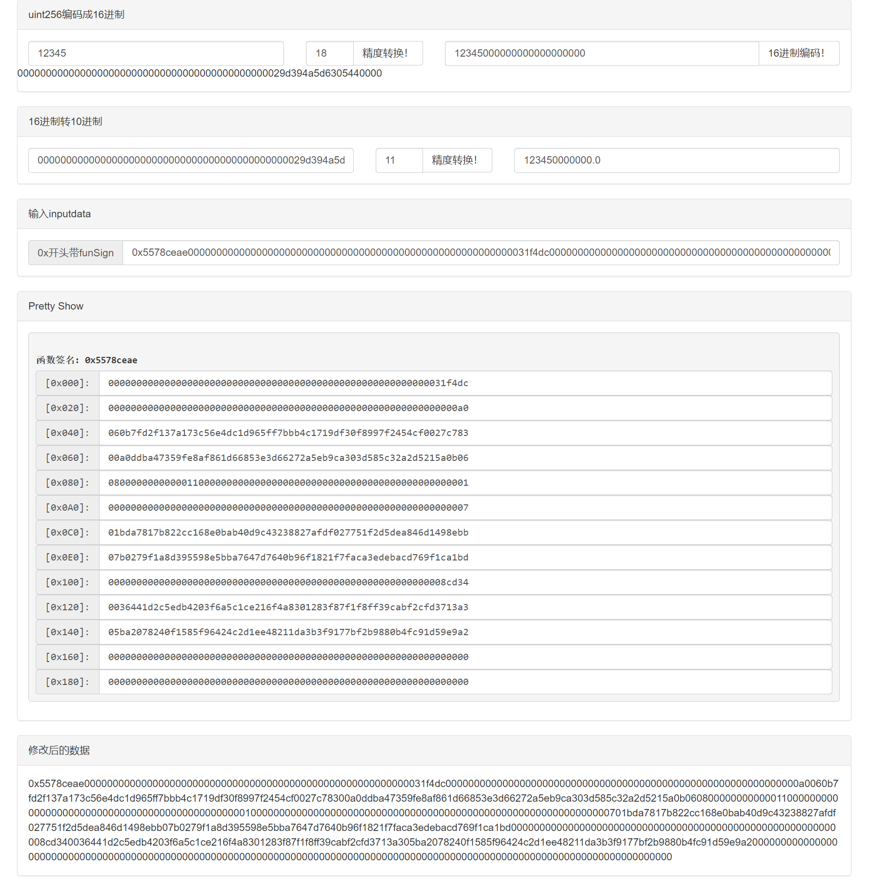

# online-ethereum-abi-hexdata-edit-toolkits
#### online-ethereum-abi-hexdata-edit-toolkits

A quick online toolkits to edit abi arguments used in solidity. 

## Function
- Unit convert
- Convert decimal to hexadecimal and pad with zeros to 32 bits
- Pretty show the hexadecimal inputdata
- Edit the inputdata in pretty show and real-time preview the raw format

## Example

## Demo
[Live / Demo](https://david-guo.github.io/inputPrettyEdit/)

## Contribute
https://github.com/David-Guo/inputPrettyEdit/issues